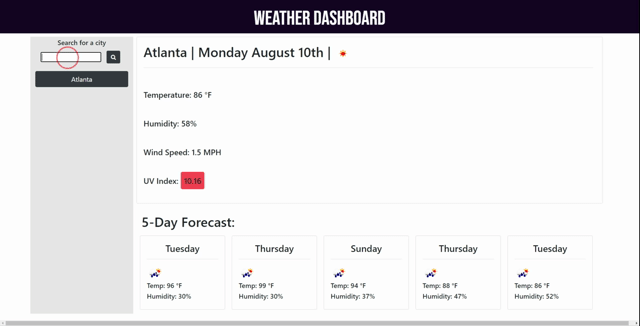

# Weather-Dashboard
A Weather Dashboard application which shows users weather data based on the cities they input.

## Technology
This application was created using JavaScript, jQuery, HTML, and CSS. The weather Data is gathered using the Open weather API which we then use to display a five-day forecast as well as current wheather data. This application also uses the moment.js Library to handle our dates and local storage to save the searched cities.

## Use
- Type the name of a city and hit search.
- This will display the selected city's Weather data including temperature, humidity, wind speed, and UV index as well as a five day forecast.
- Whatever cities you have searched will be saved to the sidebar for later use.

- - -
[Weather app](https://santu14.github.io/Weather-Dashboard/)
